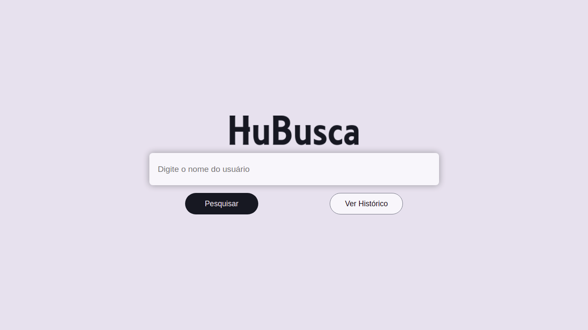
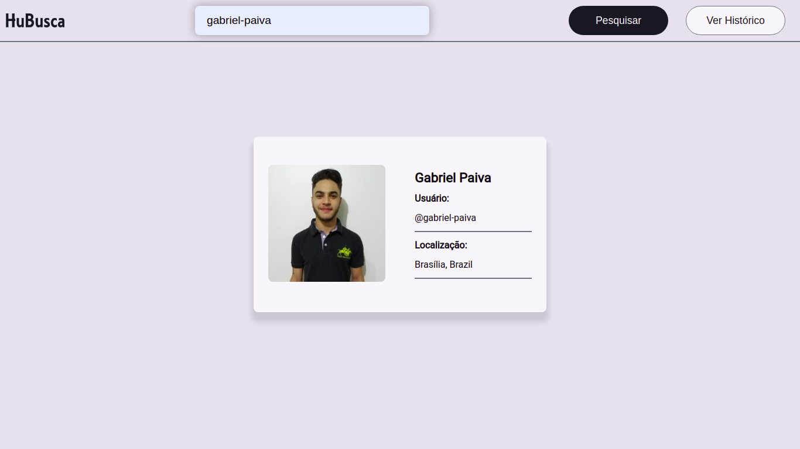
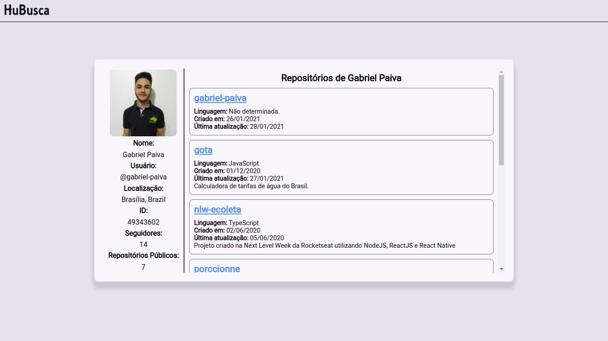
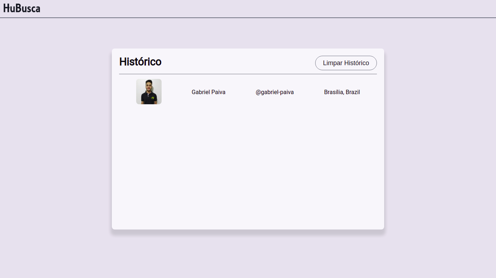

# HuBusca

O HuBusca é um aplicativo web que se conecta a API do Github para permitir pesquisa de dados específicos de seus usuários, gerando perfis dos usuários pesquisados.

Esse projeto foi feito para solucionar o desafio proposto pela Clicksoft.

## Acesse o HuBusca

O HuBusca está acessível no link: https://hubusca.vercel.app/

## Screenshots



<br/>
<br/>



<br/>
<br/>



<br/>
<br/>



<br/>
<br/>

## Rodando o projeto localmente

1. Clone o projeto com o comando:

``` 
git clone https://github.com/gabriel-paiva/hubusca
```

2. Entre na pasta do projeto
``` 
cd hubusca
```

3. Instale as dependências
``` 
npm install
```

4. Suba o servidor
``` 
npm start
# ou
yarn dev
```

5. Acesse o projeto pelo navegador na URL: 
```
localhost:3000
```